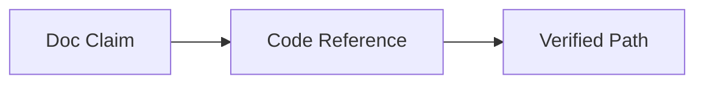

# Output Template

## Scope
- Docs targets:
- Audience:
- Coverage expectations:

## Codebase Map (Read-Only)
- Frontend:
- Backend:
- Data/storage:
- Integrations:

## Compliance Findings
- Structure and formatting:
- Terminology consistency:
- Codebase alignment:
- API accuracy:
- Platform/backend specifics:
- Risk/compliance (security, privacy, cost, dependencies):

## Best Recommendation
- Choice:
- Rationale:
- Why this is best for the context:

## Remediation Plan

| Priority | Issue | Proposed Fix | Evidence (file/path) |
| --- | --- | --- | --- |
| P0 |  |  |  |

## Optional Diagram (Mermaid)
Use when explaining system flow or data flow.

Example:

## Evidence
- Files reviewed:
- Script outputs:
