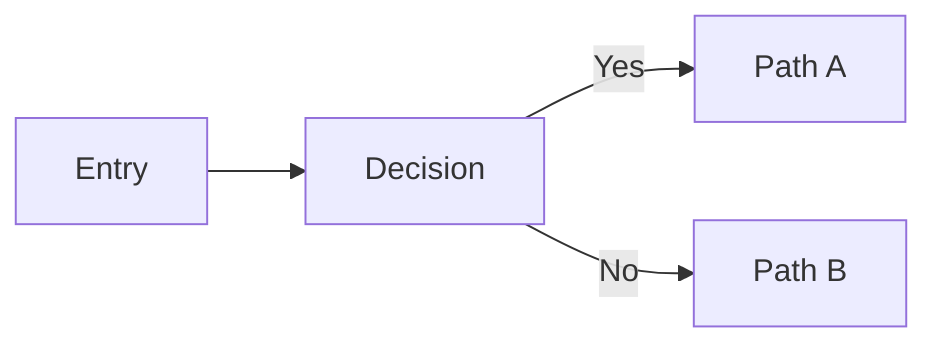

# Output Template

## Summary
- Scope:
- Key logic:
- Overall assessment:

## Logic Explanation
- Main control flow:
- Data flow:
- Decision points:

## Findings (Strengths / Risks / Issues / Potential / Solutions)

| Category | Item | Evidence | Risk | Proposed Solution |
| --- | --- | --- | --- | --- |
| Strength |  |  |  |  |
| Risk |  |  |  |  |
| Issue |  |  |  |  |
| Potential |  |  |  |  |

## Recommendation (Single Best)
- Choice:
- Rationale:
- Why this is best for the context:

## Effort Estimate
- Effort: Easy / Medium / Hard
- Key implementation steps:

## Optional Diagram (Mermaid)
Use when explaining system flow, dependencies, or logic transitions.

Example:

## Evidence
- Files reviewed:
- Script outputs:
