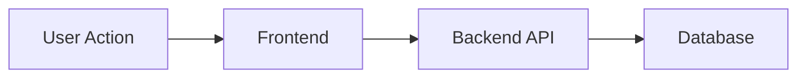

# Output Template

## Goal Summary
- Objective:
- Target users:
- Constraints:
- Timeline:

## Repo Map
- Frontend:
- Backend:
- Infra/ops:
- Data/storage:
- Integrations:

## Constraints and Dependencies
- Constraints:
- Dependencies:
- System assumptions:

## Idea List (3-7)
1)
2)
3)

## Best Recommendation
- Choice:
- Rationale:
- Why this is best for the context:

## Effort Estimate (Qualitative)
- Effort: Easy / Medium / Hard
- Key implementation steps (high level):

## Risk Summary

| Category | Risk | Notes |
| --- | --- | --- |
| Security |  |  |
| Performance |  |  |
| Compliance |  |  |
| Cost |  |  |
| Resource Dependency |  |  |

## Optional Diagram (Mermaid)
Use a diagram when explaining flows, architecture, or dependencies.

Example:

## Sources
- Include at least one GitHub source.
- List other sources used for validation or inspiration.
