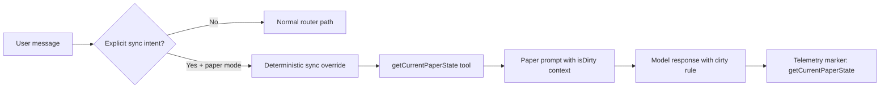

# Design Doc: Dirty-Context Aware Synchronization (Deterministic Path)

Tanggal: 27 Februari 2026  
Status: Draft untuk validasi sebelum eksekusi code  
Scope: Chat runtime paper mode (`/chat`) + observability (`/ai-ops`)

---

## 1) Latar Belakang

Masalah operasional saat ini:
1. User melihat warning dirty di validation panel, tapi model belum selalu sadar bahwa data stage belum sinkron.
2. Perintah seperti "sinkronkan data", "cek state", atau "lanjut dari state saat ini" masih bergantung pada inisiatif model.
3. Dari trace runtime, jalur sinkronisasi belum deterministik: tool `getCurrentPaperState` tidak terbukti terpanggil secara konsisten.

Dampak:
1. UX membingungkan (UI bilang dirty, tapi respons model tidak selalu menindaklanjuti sinkronisasi).
2. Risiko halusinasi konteks stage aktif.
3. Sulit diaudit karena tidak ada marker telemetry khusus sinkronisasi.

---

## 2) Tujuan

Membangun jalur deterministik untuk perintah sinkronisasi pada paper mode:
1. Intent sinkronisasi terdeteksi eksplisit di router.
2. Router memaksa panggil `getCurrentPaperState` (bukan menunggu keputusan model).
3. `isDirty` selalu masuk ke context prompt paper mode.
4. Saat `pending_validation + isDirty=true`, model wajib memberi arahan sinkronisasi yang tepat.
5. Ada telemetry marker untuk audit di `/ai-ops`.

Non-goal:
1. Tidak mengubah skema workflow 13 tahap.
2. Tidak menambah tool baru.
3. Tidak mengubah semantics `isDirty` existing di Convex.

---

## 3) Baseline Audit Codebase (Saat Ini)

### 3.1 Yang sudah benar
1. Dirty flag lifecycle sudah ada:
   - Set true: `convex/paperSessions.ts` (`markStageAsDirty`).
   - Reset false: `convex/paperSessions.ts` (`approveStage`).
2. Warning dirty di UI chat sudah render conditional `isDirty`:
   - `src/components/chat/ChatWindow.tsx`
   - `src/components/paper/PaperValidationPanel.tsx`
3. Dashboard `/ai-ops` sudah konsumsi `isDirty`:
   - `convex/aiOps.ts` (`sessionsWithDirty` dan payload session list/detail).

### 3.2 Gap terhadap tujuan deterministik
1. Belum ada intent sinkronisasi eksplisit di router chat.
2. Belum ada forced routing untuk tool `getCurrentPaperState` saat user minta sinkronisasi.
3. `paper-mode prompt` belum menginjeksi `isDirty` ke context model.
4. Belum ada aturan eksplisit di prompt untuk respons dirty-context (pending_validation + dirty).
5. Telemetry belum punya marker khusus jalur sinkronisasi; `toolUsed` dominan hanya `google_search`.

Kesimpulan audit: kondisi saat ini **belum memenuhi** tujuan deterministik.

---

## 4) Solusi Arsitektural

## 4.1 Intent Layer (Deteksi eksplisit)
Tambahkan helper `isExplicitSyncRequest(text: string): boolean` di layer routing chat.

Kriteria frasa (minimum):
1. `sinkron`
2. `sinkronkan`
3. `cek state`
4. `status sesi`
5. `lanjut dari state`
6. `status terbaru`

Aturan:
1. Berlaku hanya saat paper mode aktif.
2. Tidak override jika user eksplisit minta websearch.

## 4.2 Router Deterministic Override
Jika `paperMode aktif && isExplicitSyncRequest === true`:
1. `enableWebSearch = false`
2. `toolChoice = { type: "tool", toolName: "getCurrentPaperState" }`
3. `stopWhen = stepCountIs(1)`

Tujuan: 1 turn sinkronisasi harus mengambil state terbaru dulu sebelum model menjawab panjang.

## 4.3 Prompt Context Injection (isDirty)
Perluas context paper-mode prompt agar memuat:
1. `stageStatus`
2. `isDirty`
3. arahan operasional jika `pending_validation + isDirty=true`

Contoh instruksi wajib:
1. "Jika status `pending_validation` dan `isDirty=true`, jelaskan bahwa data stage belum sinkron."
2. "Instruksikan user meminta revisi dahulu sebelum update/sinkronisasi draf."

## 4.4 Dirty Response Rule (Behavior Contract)
Kontrak respons model saat dirty:
1. Nyatakan status desinkron secara eksplisit.
2. Berikan 1 langkah konkret berikutnya (minta revisi dulu agar update stage tersedia lagi).
3. Hindari klaim seolah data sudah sinkron jika belum.

## 4.5 Telemetry Marker
Saat deterministic sync path aktif, log marker:
1. `toolUsed: "getCurrentPaperState"`
2. `reason`: `explicit_sync_request`
3. `mode`: tetap `paper` (bukan `websearch`)

Ini diperlukan agar `/ai-ops` bisa audit frekuensi sinkronisasi dan kualitas behavior.

---

## 5) Data Flow Target

---

## 6) Acceptance Criteria

Fungsional:
1. Untuk prompt "lanjut dari state saat ini" pada paper mode, route wajib memilih `getCurrentPaperState`.
2. `google_search` tidak boleh aktif di jalur sinkronisasi deterministik.
3. Prompt paper mode mengandung `isDirty` saat session tersedia.
4. Jika `pending_validation + isDirty=true`, respons model memuat arahan sinkronisasi (minta revisi dulu).

Observability:
1. `aiTelemetry` merekam `toolUsed: getCurrentPaperState` untuk request sinkronisasi.
2. Data marker bisa di-query dan cocok dengan request yang dites.

Keamanan regresi:
1. Flow non-sync tetap tidak berubah.
2. Flow websearch eksplisit tetap berjalan.

---

## 7) Risiko dan Mitigasi

1. Risiko false-positive intent sinkronisasi.
   - Mitigasi: regex sempit + pengecualian explicit websearch intent.
2. Risiko over-constraining tool choice.
   - Mitigasi: override hanya untuk paper mode + explicit sync intent.
3. Risiko telemetry tidak lengkap.
   - Mitigasi: marker di titik final logging yang sudah existing.

---

## 8) Rencana Verifikasi Pasca-Implementasi

1. Test manual 3 prompt sinkronisasi di paper mode.
2. Test pembanding prompt non-sync (kontrol).
3. Audit data `messages` + `aiTelemetry`:
   - pastikan `toolUsed=getCurrentPaperState` muncul.
4. Validasi UX dengan warning dirty aktif:
   - respons model konsisten dengan status dirty.

---

## 9) Keputusan Desain

Rekomendasi final: lanjut dengan deterministic router override + prompt dirty contract + telemetry marker, karena ini:
1. Paling terukur.
2. Paling kecil risiko regresi.
3. Langsung bisa diaudit bukti runtime.
