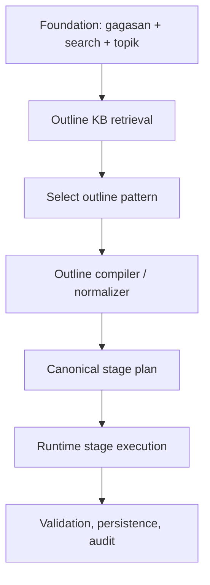

# Outline Knowledge Base Architecture

## Ringkasan

Dokumen ini memetakan arsitektur baru `outline knowledge base` ke runtime makalahapp setelah paradigma diperketat. Fokus utamanya adalah memisahkan dengan jelas empat hal: `foundation workflow`, `external outline schema`, `canonical stage plan`, dan `runtime execution`. Hasil akhirnya: model tetap bisa memanfaatkan outline kampus/negara yang berbeda, tetapi runtime tidak pernah meninggalkan stage canonical internal.

## Detail

- **Nama**: Arsitektur `outline knowledge base`
- **Peran**: Menjadi lapisan referensi struktur eksternal yang dikompilasi ke plan canonical.
- **Alur Utama**:
  - `gagasan + search referensi + topik` wajib selesai.
  - Model membaca `outline wiki`.
  - Model memilih `outline pattern`.
  - `outline compiler` menerjemahkan pattern menjadi `canonical stage plan`.
  - Runtime dan stage skill bekerja memakai plan canonical tersebut.
- **Dependensi**:
  - Knowledge base markdown wiki.
  - Tool retrieve/select/compile outline.
  - Prompt dan stage skill yang stage-aware, bukan outline-ontology-aware.
- **Catatan**:
  - Outline baru tidak berarti workflow baru.
  - Yang bertambah adalah `external pattern`, bukan `state machine` baru.

## Empat Layer Operasional

### 1. Foundation workflow

Mandatory:

- `gagasan`
- `search referensi`
- `topik`

Fungsi:

- mengunci konteks dasar paper
- memastikan outline dipilih berdasarkan topik dan evidence yang cukup

### 2. External outline schema

Fungsi:

- menyimpan variasi struktur akademik
- memberi model referensi tentang chapter layout, terminology, dan kebiasaan institusional

Komponen:

- `outline registry`
- `outline wiki`
- `pattern pages`

Catatan:

- layer ini tidak boleh langsung dipakai runtime

### 3. Canonical stage plan

Fungsi:

- menjadi hasil kompilasi yang dipahami runtime
- menjaga semua istilah kembali ke ontology stage internal
- menentukan stage canonical mana yang required, optional, shared, atau missing

Komponen:

- `outline compiler`
- `normalized section mapping`
- `compatibility evaluator`

### 4. Runtime execution layer

Fungsi:

- menjalankan drafting
- menyimpan `stageData`
- membuat dan memperbarui artifact
- menjalankan validation lifecycle
- menjalankan persistence, observability, dan verification

Catatan:

- runtime hanya memakai `canonical stage plan`

## Relasi Antar-Layer

## Komponen Wajib Baru

### `outline compiler`

Fungsi:

- membaca pattern eksternal
- memetakan section ke stage canonical
- mendeteksi exact / partial / shared / unmapped mapping
- mengevaluasi compatibility
- menambah stage wajib yang hilang jika memakai mode assistive

### `canonical stage plan`

Fungsi:

- menjadi kontrak operasional runtime
- menggantikan `active blueprint` yang sebelumnya terlalu dekat ke ontology eksternal

### `compatibility evaluator`

Fungsi:

- menilai apakah pattern eksternal:
  - compatible
  - compatible with augmentation
  - incompatible

## Posisi Stage

Dengan arsitektur ini:

- `stage` tetap canonical
- `outline` tidak menggantikan stage
- `compiler` menyelaraskan outline ke stage

Jadi:

- `pendahuluan`, `tinjauan_literatur`, `metodologi`, `hasil`, `diskusi`, `kesimpulan`, `daftar_pustaka`, dan lainnya tetap menjadi vocabulary internal runtime
- pattern eksternal hanya mempengaruhi:
  - chapter grouping
  - display naming
  - section emphasis
  - render composition

## Implikasi ke Prompt dan Skill

Prompt dan stage skill harus membaca:

- state canonical
- hasil compile
- alias atau grouping dari pattern

Prompt dan stage skill tidak boleh membaca:

- section eksternal mentah sebagai pengganti stage internal

## Daftar File Terkait

- `docs/model-led-tool-first/10-outline-kb-overview.md`
- `docs/model-led-tool-first/12-outline-registry-and-pattern-schema.md`
- `docs/model-led-tool-first/15-outline-compiler-and-canonical-stage-plan.md`
- `docs/model-led-tool-first/16-outline-compatibility-rules.md`
- `src/lib/chat-harness/runtime/orchestrate-sync-run.ts`
- `src/lib/chat-harness/context/assemble-step-context.ts`
- `src/lib/ai/paper-mode-prompt.ts`
- `src/lib/ai/paper-stages/**`
