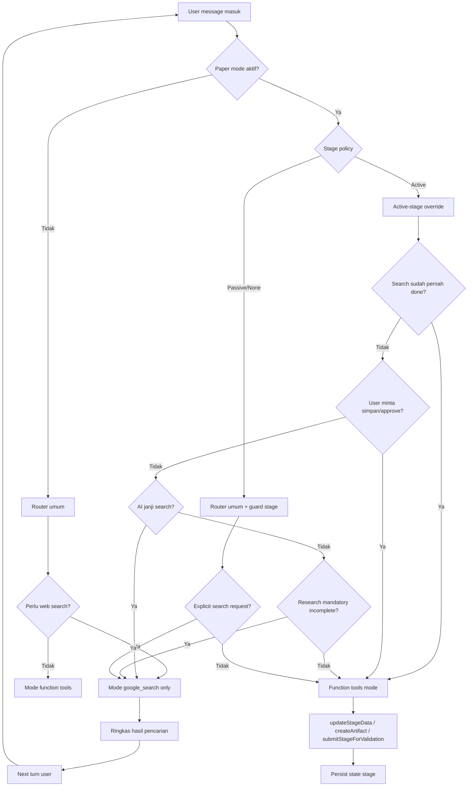

# Tool Calling per Stage - Chat Page

> Dokumentasi peta tool-calling lintas stage paper workflow untuk pendalaman teknis berikutnya.
> Fokus dokumen ini: routing mode tool, transisi state, dan guard agar tidak loop.

## Tujuan

1. Memetakan alur pemanggilan tool di semua stage.
2. Menegaskan perbedaan mode `google_search` vs function tools (tidak bisa bersamaan).
3. Menjadi acuan investigasi lanjutan untuk stabilitas state tool-calling.

## Konteks Teknis Saat Ini

- Router berada di `src/app/api/chat/route.ts`.
- Helper keputusan search berada di `src/lib/ai/paper-search-helpers.ts`.
- Tool paper berada di `src/lib/ai/paper-tools.ts`.
- Constraint SDK: provider-defined tool `google_search` tidak bisa digabung dengan function tools dalam 1 request.

---

## Diagram Utama (Current Behavior)

---

## Matrix Stage vs Tool Calling

| Stage | Peran Search | Mode Default | Catatan |
| --- | --- | --- | --- |
| gagasan | Mandatory fondasi referensi awal | Active override | Tetap mendorong literatur awal agar tidak bergantung data latih lama |
| topik | Mandatory penguatan topik definitif | Active override | Tetap mendorong referensi pendukung sebelum finalisasi topik |
| outline | Inspirasi/pengayaan (opsional-by-value) | Function tools | Search dipicu saat perlu data baru atau user minta eksplisit |
| abstrak | Inspirasi/pengayaan | Function tools | Sama: tidak dipaksa hitung kuantitas referensi |
| pendahuluan | Inspirasi/pengayaan | Active override (non-mandatory search) | Search tetap tersedia, tapi tidak boleh memicu loop simpan |
| tinjauan_literatur | Inspirasi/pengayaan | Active override (non-mandatory search) | Search untuk pendalaman literatur, bukan loop kuota minimum |
| metodologi | Inspirasi/pengayaan | Active override | Search untuk update metode atau benchmark terbaru |
| hasil | Inspirasi/pengayaan | Function tools | Search bila user minta pembanding/data baru |
| diskusi | Inspirasi/pengayaan | Active override (non-mandatory search) | Search untuk penguatan argumen bila dibutuhkan |
| kesimpulan | Inspirasi/pengayaan | Function tools | Umumnya function tools cukup |
| daftar_pustaka | Inspirasi/pengayaan | Function tools | Search opsional untuk melengkapi referensi |
| lampiran | Inspirasi/pengayaan | Function tools | Umumnya tidak wajib search |
| judul | Inspirasi/pengayaan | Function tools | Search opsional untuk trend wording/judul |

---

## Guard Rails Anti-Loop

1. Jika `searchAlreadyDone = true` dan user tidak meminta pencarian tambahan, paksa function tools mode.
2. Konfirmasi user (`approved`, `disetujui`, `lanjut`) diprioritaskan ke save/submit flow, bukan search ulang.
3. Search mandatory hanya dipakai untuk fondasi awal (`gagasan`, `topik`), bukan semua stage.
4. Search di stage lain bersifat pengembangan inspirasi (opsional-by-value), bukan kewajiban hitungan referensi.

---

## File Rujukan

- `src/app/api/chat/route.ts`
- `src/lib/ai/paper-search-helpers.ts`
- `src/lib/ai/paper-tools.ts`
- `src/lib/ai/paper-stages/foundation.ts`

