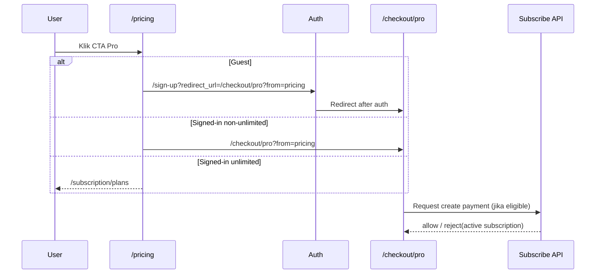

# Pricing Flow Redesign - Design Doc

Status: Draft v0.2 (audited vs codebase)  
Owner: Product + Frontend  
Based On: `docs/pricing-flow/README.md`  
Last Updated: 2026-02-26

## Ringkasan

Dokumen ini menerjemahkan keputusan di `README.md` menjadi desain teknis implementasi. Fokus redesign: user dari `/pricing` harus langsung ke checkout sesuai intent, dengan pengecualian hanya untuk tier `unlimited`. User `pro` tetap masuk `/checkout/pro`, tetapi checkout harus state-aware agar tidak membuat transaksi baru saat subscription masih aktif.

## Scope

In scope:

1. Routing CTA dari pricing page.
2. Guard behavior di `FreeLoginGate`.
3. Guard UI + API untuk checkout Pro agar selaras keputusan baru.
4. Telemetry event untuk mengukur dampak funnel.

Out of scope:

1. Redesign visual besar di pricing page.
2. Perubahan billing engine, webhook Xendit, schema Convex.
3. Perubahan flow subscription management di luar entry pricing.

## Existing Architecture (As-Is)

### Entry dari pricing card

1. `PricingCard` membentuk destination dari `plan.ctaHref`.
2. Guest diarahkan ke `/sign-up?redirect_url=<ctaHref>`.
3. Signed-in diarahkan langsung ke `ctaHref`.

File:

- `src/components/marketing/pricing/PricingCard.tsx`

### Plan CTA default (data-driven)

Baseline konten pricing terbaru (migration `updatePricingPageContent`):

1. `bpp`: `/subscription/plans`
2. `pro`: `/subscription/upgrade`
3. `gratis`: `/chat`

Catatan penting:

1. Nilai `ctaHref` tidak hardcoded permanen.
2. Nilai ini bisa berubah di database via mutation admin (`updatePricingPlan`).

File:

- `convex/migrations/seedPricingPlans.ts`
- `convex/pricingPlans.ts`

### Redirect chain subscription area

1. `/subscription/upgrade` -> `/subscription/plans`
2. `/subscription/plans` + tier `gratis/bpp` -> `/subscription/overview`
3. `/subscription/topup` -> `/checkout/bpp`

File:

- `src/app/(dashboard)/subscription/upgrade/page.tsx`
- `src/app/(dashboard)/subscription/plans/page.tsx`
- `src/app/(dashboard)/subscription/topup/page.tsx`

### Guard yang menimbulkan friksi

1. `FreeLoginGate` dapat memaksa user gratis ke `/get-started`.
2. Checkout Pro UI saat ini short-circuit untuk `pro` dan `unlimited`.
3. Subscribe API saat ini reject jika `subscriptionStatus === "pro"`.

File:

- `src/components/onboarding/FreeLoginGate.tsx`
- `src/app/(onboarding)/checkout/pro/page.tsx`
- `src/app/api/payments/subscribe/route.ts`

### Definisi "aktif" (untuk hindari ambigu)

1. **Subscription aktif**
   - Konteks billing recurring Pro.
   - Operasional: ada record subscription dengan `status: "active"` (dipakai guard API subscribe).
2. **Kapasitas aktif**
   - Konteks kemampuan lanjut pakai fitur.
   - Operasional: kuota/kredit yang bisa dipakai saat ini.
   - Untuk Pro: kuota bulanan dulu, lalu fallback ke kredit BPP.
3. Implikasi:
   - `subscription aktif` tidak otomatis berarti kapasitas selalu cukup.
   - Saat kapasitas habis, jalur top up BPP tetap harus tersedia.

## Target Architecture (To-Be)

### Routing contract entry `/pricing`

1. Guest:
   - BPP -> `/sign-up?redirect_url=/checkout/bpp?from=pricing`
   - Pro -> `/sign-up?redirect_url=/checkout/pro?from=pricing`
2. Signed-in:
   - BPP -> `/checkout/bpp?from=pricing`
   - Pro (termasuk tier `pro`) -> `/checkout/pro?from=pricing`
3. Signed-in `unlimited`:
   - Pro -> `/subscription/plans`

### Checkout Pro state-aware contract

1. User `pro` tetap boleh masuk halaman checkout Pro.
2. Jika **subscription aktif**:
   - render status aktif
   - nonaktifkan aksi create payment baru
   - tampilkan CTA kelola langganan
3. Jika subscription non-aktif/eligible:
   - tampilkan aksi lanjutan sesuai status (reactivate atau payment baru)

### Top Up BPP contract untuk user Pro

1. User Pro tetap boleh membeli paket top up BPP saat butuh kapasitas tambahan.
2. Kondisi penting:
   - Pro + kuota habis + kredit 0 -> diarahkan ke jalur top up (`/checkout/bpp`).
   - Pro + kuota habis + kredit masih ada -> lanjut via fallback kredit, top up opsional.
3. Paket yang dipakai tetap paket paper BPP (baseline Rp80.000, data-driven dari pricing helper/DB).

### API subscribe contract

1. Tetap reject untuk `unlimited` dan admin/superadmin.
2. Jangan reject semata-mata karena `subscriptionStatus === "pro"`.
3. Active subscription tetap hard-stop untuk create payment baru.
4. Kembalikan response eksplisit agar UI bisa state-aware.

## Design Detail per File

### `src/components/marketing/pricing/PricingCard.tsx`

Peran:

- Sumber utama destination CTA di pricing card.

Perubahan:

1. Tambah resolver destination khusus entry `/pricing` berbasis:
   - `plan.slug`
   - auth state
   - effective tier
2. Prioritas resolver:
   - jika `plan.slug === "bpp"` -> route checkout bpp
   - jika `plan.slug === "pro"`:
     - `unlimited` -> `/subscription/plans`
     - selain itu -> route checkout pro
3. `ctaHref` tetap jadi fallback untuk slug tidak dikenal.

Acceptance:

1. Tidak ada jalur `/pricing -> /subscription/plans` untuk `gratis/bpp/pro` saat klik Pro.
2. `from=pricing` selalu ada pada jalur checkout dari pricing.

### `src/components/onboarding/FreeLoginGate.tsx`

Peran:

- Gate satu kali per sesi untuk user tier gratis.

Perubahan:

1. Tambah exception pathname `/checkout/*`.
2. Saat user masuk checkout via intent pricing, gate tidak override ke `/get-started`.

Acceptance:

1. Guest signup dari pricing yang targetnya checkout tidak mental ke `/get-started`.

### `src/app/(onboarding)/checkout/pro/page.tsx`

Peran:

- Halaman checkout Pro + state pembayaran frontend.

Perubahan:

1. Ubah guard page-level:
   - hard block hanya `unlimited`
   - `pro` tetap boleh mengakses halaman
2. Tambah cabang render state-aware:
   - active subscription -> informational state + CTA manage
   - eligible state -> normal checkout flow

Acceptance:

1. User `pro` bisa akses `/checkout/pro`.
2. User `pro` active subscription tidak melihat aksi bayar baru.

### `src/app/api/payments/subscribe/route.ts`

Peran:

- Endpoint pembuatan payment request untuk subscribe Pro.

Perubahan:

1. Guard role/tier:
   - tetap block `unlimited`, `admin`, `superadmin`
2. Hapus reject berbasis `subscriptionStatus === "pro"` saja.
3. Gunakan `getActiveSubscription` sebagai guard final create payment.
4. Return error payload yang jelas untuk active subscription case.

Acceptance:

1. User `pro` tanpa active subscription bisa lanjut create payment.
2. User `pro` dengan active subscription tidak membuat payment baru.

### `src/app/(onboarding)/checkout/bpp/page.tsx` + `src/app/api/payments/topup/route.ts`

Peran:

- Jalur pembelian kredit BPP lintas tier (termasuk Pro).

Perubahan:

1. Tidak ada block tier Pro pada flow top up.
2. Pastikan copy state Pro menegaskan top up sebagai kapasitas tambahan saat kuota bulanan habis.
3. Pastikan package yang diproses tetap package paper BPP (baseline Rp80.000) melalui pricing helper.

Acceptance:

1. User `pro` bisa create payment top up di `/api/payments/topup`.
2. Top up sukses menambah kredit user Pro tanpa mengubah status subscription Pro aktifnya.

### `src/lib/utils/redirectAfterAuth.ts`

Peran:

- Sanitasi redirect path setelah auth.

Perubahan:

1. Validasi tetap menerima checkout path + query (`?from=pricing`).
2. Tidak ada perubahan whitelist utama kecuali dibutuhkan.

Acceptance:

1. Path checkout dengan query tracking tetap lolos.

## Sequence (Target)

## Telemetry Design

Event:

1. `pricing_cta_clicked`
   - `plan_slug`
   - `auth_state`
   - `effective_tier`
2. `pricing_checkout_landed`
   - `plan_slug`
   - `from`
3. `payment_initiated`
   - `plan_slug`
   - `payment_method`

Analisis funnel:

1. `pricing_cta_clicked -> pricing_checkout_landed`
2. `pricing_checkout_landed -> payment_initiated`

## Test Strategy

### Functional

1. Guest:
   - pricing BPP/Pro -> auth -> checkout target.
2. Signed-in `gratis/bpp/pro`:
   - pricing Pro -> checkout Pro.
3. Signed-in `unlimited`:
   - pricing Pro -> subscription plans.

### Guard Regression

1. FreeLoginGate tidak override checkout path.
2. Active subscription tidak bisa create payment baru.
3. Route lama tetap valid:
   - `/subscription/topup` -> `/checkout/bpp`
4. Pro capacity path tetap valid:
   - Pro + kuota habis + kredit nol -> tersedia CTA/route top up BPP.
   - Pro + kuota habis + kredit tersedia -> tetap dapat lanjut via fallback kredit.

### API

1. `subscribe` reject tepat untuk `unlimited/admin/superadmin`.
2. `subscribe` reject active subscription.
3. `subscribe` tidak reject hanya karena status string `pro`.

## Rollout Plan

1. Phase 1: deploy routing contract + guard alignment.
2. Phase 2: monitor KPI 3-7 hari.
3. Phase 3: rapikan fallback path yang tidak dipakai untuk entry pricing.

## Acceptance Criteria Final

1. Dari `/pricing`, user `gratis/bpp/pro` klik Pro mendarat ke `/checkout/pro?from=pricing`.
2. Hanya `unlimited` yang tidak diarahkan ke checkout Pro.
3. User `pro` active subscription tidak bisa membuat payment baru.
4. Tidak ada redirect berantai ke subscription management untuk intent checkout dari pricing.
