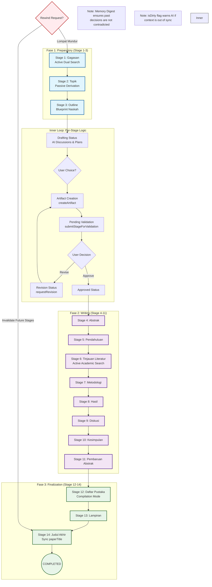

# Visual Flow: Makalah AI 14-Stage Lifecycle

Diagram ini menggambarkan alur kerja ideal pengguna dari awal gagasan hingga naskah final, mencakup mekanisme validasi dan logika lintas stage.

---

## 🔍 Rujukan Kode (Audit Forensik)

Berdasarkan pembacaan kode langsung (tanpa mengandalkan komentar), berikut adalah rujukan implementasi faktual:

| Komponen | File Path | Baris/Logika |
| :--- | :--- | :--- |
| **Stage Order** | [constants.ts](file:///Users/eriksupit/Desktop/makalahapp/.worktrees/what-is-makalah/convex/paperSessions/constants.ts) | `STAGE_ORDER` (L1-16) berisi 14 tahapan kronologis. |
| **Search Policy** | [skill-contracts.ts](file:///Users/eriksupit/Desktop/makalahapp/.worktrees/what-is-makalah/src/lib/ai/stage-skill-contracts.ts) | `ACTIVE_SEARCH_STAGES` (L3) & `PASSIVE_SEARCH_STAGES` (L7). |
| **Inner Loop Logic** | [paperSessions.ts](file:///Users/eriksupit/Desktop/makalahapp/.worktrees/what-is-makalah/convex/paperSessions.ts) | `approveStage` (L1321) & `requestRevision` (L1477) status guard. |
| **Memory Digest** | [paperSessions.ts](file:///Users/eriksupit/Desktop/makalahapp/.worktrees/what-is-makalah/convex/paperSessions.ts) | `updatedDigest` (L1390) menyimpan keputusan untuk konteks masa depan. |

---

## Referensi Dokumen Sumber
- [User Flows 00: General Mechanisms](./user-flows-00.md)
- [Lifecycle States Documentation](./03-lifecycle-states.md)

---
> [!TIP]
> Alur ini didesain supaya AI nggak pernah kerja sendirian tanpa pengawasan lo. Lo adalah "Pawang", AI adalah "Tukangnya". Transisi antar status dijamin oleh *Backend Enforcer* di level database.
